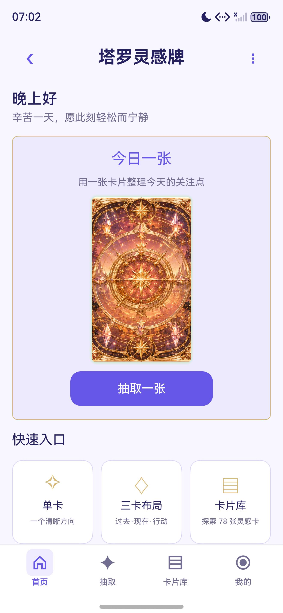
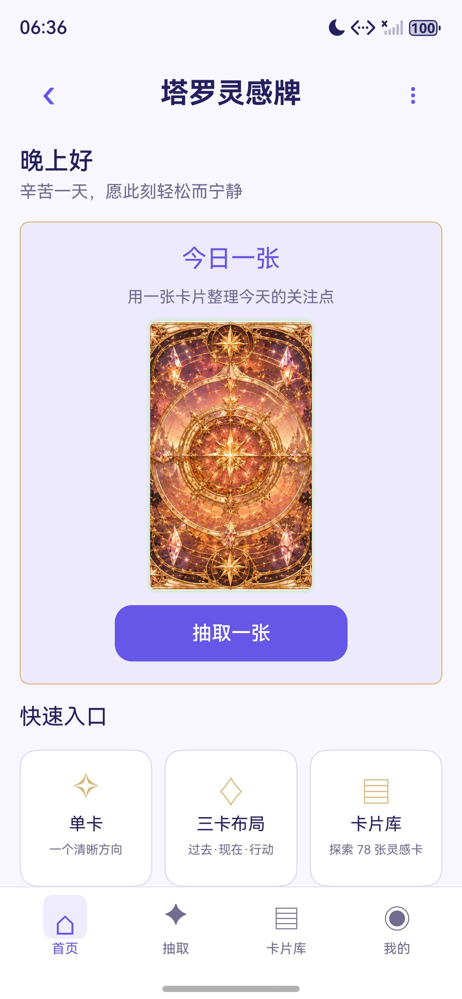
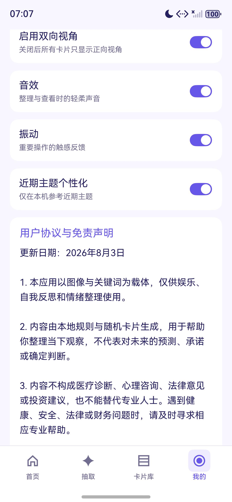

# 塔罗灵感牌

HarmonyOS NEXT 原生离线灵感卡与自我反思工具：78 张卡片、两套视觉主题、三次整理后凭直觉选卡、按问题场景生成结构化观察提示，记录与卡片笔记只存在本机；不申请网络权限，无注册、广告、内购与第三方统计。

> 关于名称：仓库目录与 bundleName 沿用 `taluopai` / `com.tarotinspiration.offline`，应用内当前统一使用「灵感卡 / 卡片」这套表述（卡片库、卡片笔记、正向视角 / 侧向视角），卡片数据由程序按主题词生成，不再包含逐张硬编码的牌义文本。

## 技术栈

- HarmonyOS NEXT，兼容与目标 SDK `6.0.2(22)`，Stage 模型，ArkTS / ArkUI 声明式 UI，`entry` 单 HAP 模块
- 设备类型：phone、tablet
- 无第三方运行时依赖，仅本地 OHPM 依赖（测试用 `@ohos/hypium`）
- 本地持久化：`@kit.ArkData` Preferences（键空间 `tarot_inspiration_local_v1`），记录以 `TR4:` 版本化文本编码，仍可读取历史的 `TR3:` 记录；读取失败时提供「清空损坏的本地数据」恢复入口
- 反馈：`@kit.MediaKit` SoundPool 播放单条本地短音效，`@kit.SensorServiceKit` 振动按事件区分时长（整理 / 选卡 / 查看）
- 解读为本机规则引擎（`InterpretationService`，算法版本 3）：问题分类 + 场景知识 + 卡片主题关键词 + 牌阵关系组合生成，不依赖网络模型
- 目录结构按 AGENTS.md 约定分层：`pages/` 编排、`components/` 复用 UI、`services/` 领域能力、`repositories/` 持久化、`models/` 模型、`common/` 设计令牌与纯逻辑

## 功能特性

**首页**

- 分时段问候，六个时段各有标题与副文案：早上好 / 上午好 / 中午好 / 下午好 / 晚上好 / 夜深了
- 「今日一张」入口：点击牌背进入每日灵感抽取
- 快速入口三张卡：单卡、三卡布局、卡片库
- 今日灵感说明与引导文案

**卡片库**

- 78 张卡片：22 张主牌 + 权杖、圣杯、宝剑、星币各 14 张，每张都有中文名与英文名
- 每张卡片的正向 / 侧向视角由 6 组主题关键词派生（开始 / 选择 / 行动 / 信心，专注 / 表达 / 创造 / 节奏，连接 / 倾听 / 边界 / 理解，整理 / 平衡 / 取舍 / 清晰，休息 / 恢复 / 耐心 / 照顾，成长 / 学习 / 尝试 / 复盘），并组合出对应的观察提示、可供尝试的小步骤与留给自己的问题；卡片数据由 `TarotCatalogData.ets` 生成，不再是逐张硬编码的牌义库
- 卡片库筛选：全部 / 收藏 / 主题 A–E，并可按卡片编号或英文名搜索
- 两套视觉主题，各含 78 张正面牌面与一张同主题牌背：月影花庭（月夜花园 · 柔和紫金）、鎏星穹庭（星辰彩窗 · 深蓝鎏金）

**抽牌流程**

- 三次整理后才能进入选卡，选卡按第一直觉依次选择、确认前可更换，确认张数无误后逐张查看
- 四套牌阵布局（`SpreadService`）：
  - 单卡「核心提示」
  - 三张观察流「已发生 / 正在发生 / 下一步行动」，也是首页「三卡布局」快速入口使用的布局
  - 关系观察「我的状态 / 对方或外部状态 / 关系核心」
  - 七张深入布局「当前状态 / 问题根源 / 已知资源 / 隐藏影响 / 当前阻碍 / 行动建议 / 发展趋势」
- 结果页分区呈现：观察提示、主题联系、可以尝试、留给自己的问题，命中高风险话题时追加温和提醒
- 可继续添加补充卡，每张补充卡给出澄清焦点、这张牌的提示、对原解读的影响与下一步提示

**解读与安全边界**

- 结合问题场景（学习 / 事业 / 情感 / 人际 / 自我成长 / 今日指引）、可选心情（平静 / 期待 / 紧张 / 困惑 / 低落）与解读方式（简洁 / 深入）组合生成解读
- 多张卡片时生成主题联系：由 `ReadingRelationshipService` 分析各位置关系，深入模式会补充行动方向的整理
- 近期主题个性化：可参考本机近期记录里反复出现的关键词（设置内可关闭）
- 高风险话题（医疗、法律、投资、自伤等关键词表）追加温和提醒，并把「一定会 / 注定 / 必然 / 保证」一类绝对化措辞软化为可能性表述
- 问题输入限制 300 字，超出给出提示；可跳过问题直接抽取

**记录、收藏与笔记**

- 保存解读到本机记录，可按场景、卡片与时间回看，支持单条删除与清空全部（均二次确认）
- 收藏与卡片笔记按卡片聚合，卡片详情页显示正向 / 侧向视角、象征与自己的笔记

**界面、设置与无障碍**

- 四项底部导航：首页、抽取、卡片库、我的；「灵感记录」从公共 Header 的更多菜单进入
- 设置页：视觉主题（月影花庭 / 鎏星穹庭）、启用双向视角（关闭后所有卡片只显示正向视角）、音效、振动、近期主题个性化，以及清空全部本地数据（二次确认）
- 设置页底部提供用户协议与免责声明、使用说明、关于三张说明卡；应用内不再提供独立的隐私政策卡片
- 底部导航使用四份统一尺寸的 SVG 图标，选中态、标签轨道与安全区统一处理；卡片图像、筛选标签与按钮均提供无障碍说明，触控目标至少 48vp
- 横向网格按可用宽度调整列数（卡片库 3 / 4 列，选卡 4 / 5 列），内容在平板上限制最大宽度

## 截图

工作区中 2026-08-05 的四张设备证据与当前界面一致：

| 说明 | 截图 |
| --- | --- |
| 首页与四项底部导航 |  |
| 底部导航图标轨道统一 |  |
| 反馈交互与导航 |  |
| 设置页（无独立隐私政策卡片） |  |

`docs/qa/screenshots/` 下其余截图来自 2026-07-30 至 2026-08-03 的早期版本，界面文案与配色与当前实现不同（例如旧的「每日一抽 / 单牌 / 三牌阵 / 牌库」导航），仅作为历史证据保留；完整构建、交互与安全区证据见 `docs/qa/` 与 `design-qa.md`。

## 目录结构

```
AppScope/                     应用级配置与应用名
entry/src/main/ets/
  pages/Index.ets             全部页面状态机与页面编排（首页、问题、布局、整理、选卡、查看、结果、
                              历史、卡片详情、设置、关于）
  components/                 AppHeader、BottomNavigation
  services/                   DrawService、DrawFlowService、SpreadService、InterpretationService、
                              ReadingRelationshipService、ReadingFeedbackService、QuestionClassifier、
                              SceneKnowledgeService、SafetyService、GreetingService、AppDataService、
                              ReadingRecordService、NavigationService
  repositories/               LocalAppStore（Preferences）、AppDataRepository、
                              ReadingRecordRepository、LocalDataCodec（TR4/TR3 编码）
  models/                     TarotModels、TarotAppState
  common/                     DesignTokens、ResponsiveLayout、TarotCatalogData、TarotThemeMedia、AppLogger
entry/src/main/resources/
  base/media/                 月影花庭与鎏星穹庭各 78 张牌面 + 1 张牌背，四份 SVG 导航图标
  base/element/               string / color / float 资源
  rawfile/                    reading_feedback.wav（本地短音效）、knowledge_sources.json（内容来源记录）
entry/src/ohosTest/ets/test/  Hypium 用例（抽牌、布局、解读、关系、编解码、记录、导航、问候、安全等）
docs/                         design.md / design-qa.md / changes.md / tasks.md
                              docs/assets（素材与来源）、docs/release（发布清单与政策文本）、
                              docs/qa（构建与交互证据）、docs/superpowers（设计与实施记录）
scripts/                      构建脚本、卡片与素材生成脚本、静态与交互回归门禁
```

## 构建与运行

1. 安装 DevEco Studio 并配置 HarmonyOS SDK（兼容基线 API 22 / 6.0.2），确保 `hvigorw.bat` 可用；`scripts/build-harmony.ps1` 会依次尝试仓库内 `hvigorw.bat`、PATH 中的 `hvigorw.bat`，以及 `C:\Program Files\Huawei\DevEco Studio\tools\hvigor\bin\hvigorw.bat`
2. 用 DevEco Studio 打开工程，选择 `entry` 模块的 `default` 产品直接运行
3. 或在项目根目录执行：

```powershell
# debug HAP
powershell -NoProfile -ExecutionPolicy Bypass -File .\scripts\build-harmony.ps1 -BuildMode debug
# release HAP（追加 -Clean 可先执行清理）
powershell -NoProfile -ExecutionPolicy Bypass -File .\scripts\build-harmony.ps1 -BuildMode release -Clean
```

构建产物为 `entry/build/` 下的 `*-signed.hap` 或 `*-unsigned.hap`，脚本会打印 HAP 路径与字节数。`build-profile.json5` 中的签名配置指向开发机本地证书路径，仓库不包含证书或口令，其他机器需替换为自己的签名配置后再打包。

`scripts/check-standard.ps1` 及配套的 Python / PowerShell 回归脚本依赖开发机上已安装的检查器与 Python 环境，属于维护者本地门禁，不是构建前置条件。

## 隐私说明

- `entry/src/main/module.json5` 只申请一项权限：`ohos.permission.VIBRATE`，用于整理、查看与保存时的触感反馈
- 不申请网络权限，也没有网络调用、WebView 或在线模型依赖；不申请定位、存储、相机等权限
- 用户输入的问题、心情、笔记、收藏、抽牌记录与设置只保存在本机 Preferences 中，不发送、不上传、不共享
- 清空全部本地数据会同时清除记录、收藏、卡片笔记与设置，且需二次确认；该操作不可撤销
- 不含广告、会员、内购、第三方统计或崩溃上报服务；使用说明与用户协议明确本应用仅供娱乐与自我反思，不构成医疗、心理、法律或投资建议

## 许可

代码为个人作品，仓库未附开源许可文件，默认保留全部权利，请勿直接商用或二次分发。两套主题牌面为项目自有的用户提供素材，来源与映射记录在 `docs/assets/tarot-assets.md`；卡片内容由本机规则与通用反思主题词生成，不含第三方牌义数据库。