# 塔罗灵感牌

HarmonyOS NEXT 原生离线塔罗灵感与自我反思工具：抽牌、78 张牌库、结构化解读、记录、收藏与牌义笔记全部在本机完成；不申请网络权限，无注册、广告、内购与第三方统计。

## 技术栈

- HarmonyOS NEXT，兼容与目标 SDK `6.0.2(22)`，Stage 模型，ArkTS / ArkUI 声明式 UI，`entry` 单 HAP 模块
- 设备类型：phone、tablet（tabbar 布局随可用宽度调整列数与内容最大宽度）
- 无第三方运行时依赖，仅本地 OHPM 依赖（测试用 `@ohos/hypium`）
- 本地持久化：`@kit.ArkData` Preferences（`tarot_inspiration_local_v1`），记录用 `TR4:` 版本化文本编码，仍可读取历史的 `TR3:` 记录
- 解读为本机规则引擎（`InterpretationService`，算法版本 3）：问题分类 + 场景知识 + 正逆位语义 + 牌阵关系，不依赖网络模型

## 功能特性

**首页与抽牌入口**

- 分时段问候（早上 / 上午 / 中午 / 下午 / 晚上 / 深夜）
- 每日一抽独立入口，每天固定一张作为今日灵感
- 六种抽牌方式：单牌、三张时间流、关系洞察、七张进阶牌阵，以及每日一抽与兼容入口
- 四套牌阵各带固定牌位：单牌「核心提示」；三张「过去 / 现在 / 未来趋势」；关系「我的状态 / 对方或外部状态 / 关系核心」；七张「当前状态 / 问题根源 / 已知资源 / 隐藏影响 / 当前阻碍 / 行动建议 / 发展趋势」

**牌面与牌库**

- 78 张牌完整本地数据：22 张大阿卡纳 + 权杖 / 圣杯 / 宝剑 / 星币各 14 张，含中英文名、序号、元素、正逆位关键词、牌义、象征，以及行动与反思提问
- 三套牌面资源：RWS 兼容基线一套 78 张，另有两套各 78 张正面加一张同主题牌背；牌面缺图时回落到统一占位图，不会出现空白
- 牌库支持全部 / 收藏 / 大阿 / 四元素筛选，并按中文名或英文名搜索

**抽牌流程**

- 洗牌三次后才可进入选牌页（页面提示「选择你的牌」），确认张数前可取消重选，随后逐张翻牌
- 结果页分区呈现：灵感解读、牌阵联系、可以尝试、留给自己的问题、温和提醒
- 可选继续抽澄清牌，每张澄清牌给出独立焦点、释义、对原解读的影响与下一步提示

**解读与安全边界**

- 结合问题场景（学习 / 事业 / 情感 / 人际 / 自我成长 / 今日指引）与心情（平静 / 期待 / 紧张 / 困惑 / 低落），提供简洁与深入两种解读方式
- 命中医疗、法律、投资、自伤等高危话题时追加温和提醒，并把「一定会 / 注定 / 必然」一类绝对化措辞软化为可能性表述
- 首次启动需阅读隐私政策与用户协议并确认，确认状态在本地保存成功后才进入应用

**记录、收藏与笔记**

- 保存解读到本机记录，可按主题、牌面与时间回看，支持单条删除与清空全部（均二次确认）
- 收藏与牌义笔记按牌聚合，牌义详情页可查看正逆位、象征并随时保存自己的联想

**设置与外观**

- 逆位开关（关闭后只出现正位）、音效开关、振动开关、近期主题个性化开关
- 清空全部本地数据：记录、收藏、笔记与设置一并恢复默认，需二次确认

## 截图

> 以下为 API 22 手机模拟器上的实际运行截图（开发阶段 QA 记录），每张图都已签入仓库。

| 说明 | 截图 |
| --- | --- |
| 首页与每日一抽 | 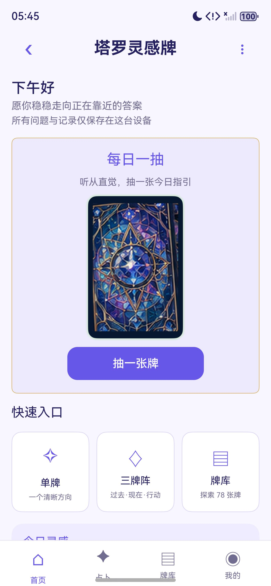 |
| 首次启动的合规确认页 | 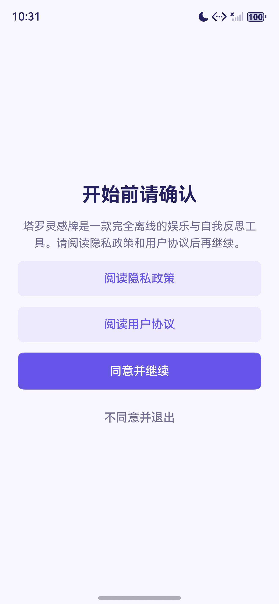 |
| 应用内隐私政策 | 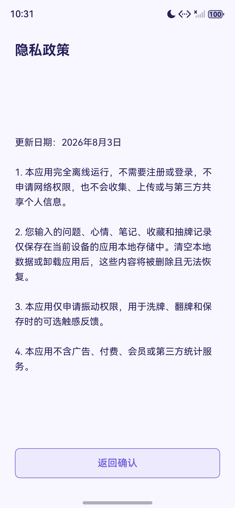 |
| 牌库：双主题牌面与筛选 | 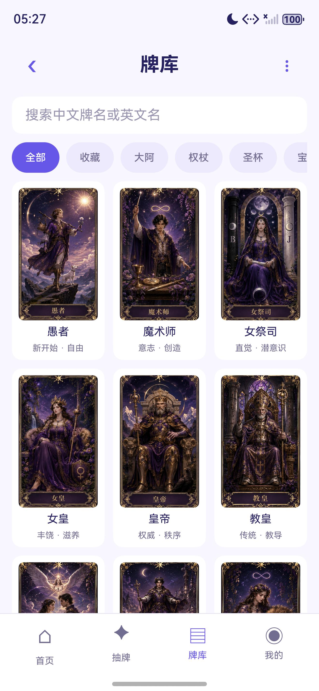 |
| 牌阵选择 | 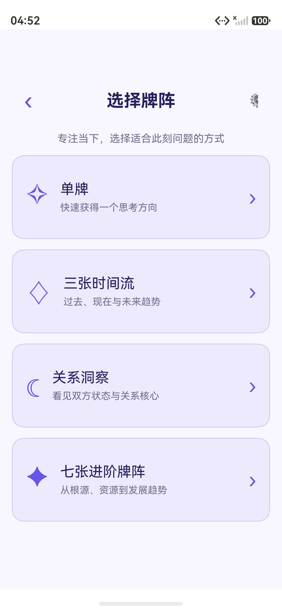 |
| 洗牌 | 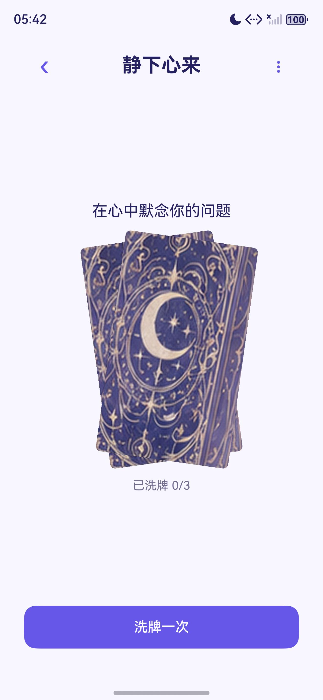 |
| 选牌：凭第一直觉依次选择 | 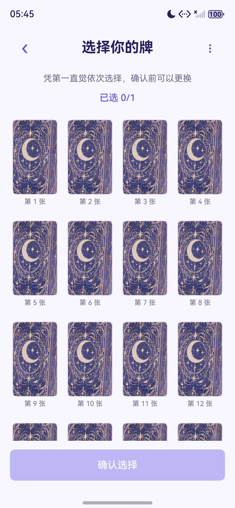 |
| 翻牌 | 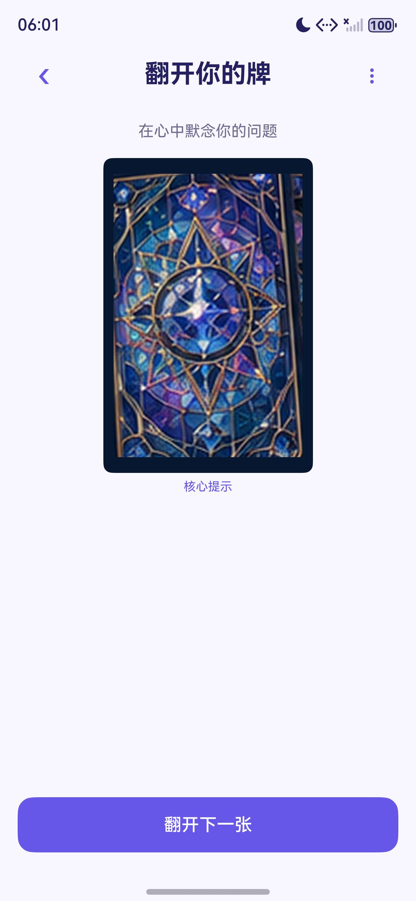 |
| 结构化解读 | 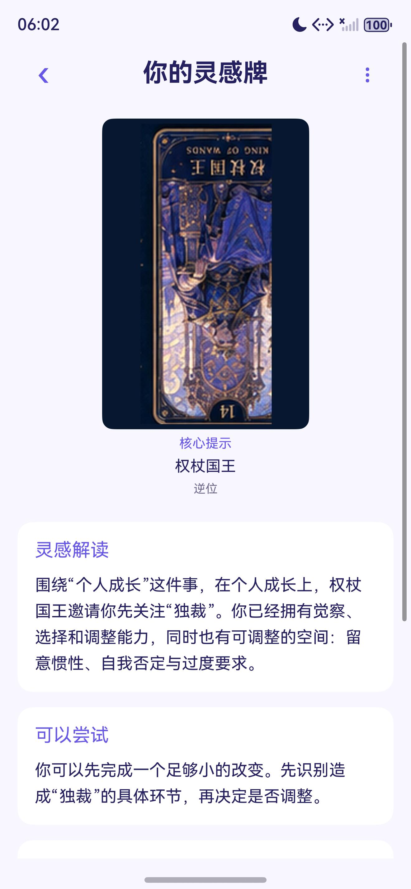 |
| 灵感记录 | 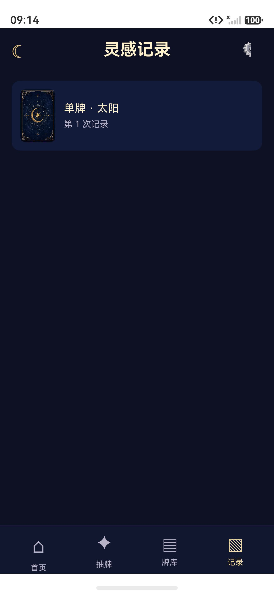 |
| 牌义详情与笔记入口 | 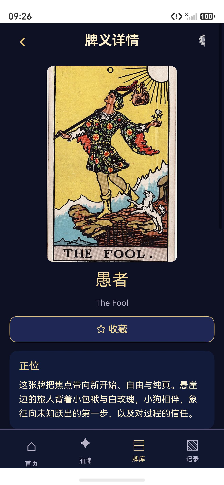 |
| 桌面图标 | 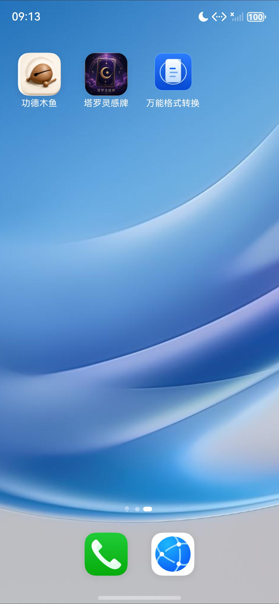 |

完整构建、交互与安全区证据见 `docs/qa/` 与 `design-qa.md`。

## 目录结构

```
AppScope/                     应用级配置、应用名与图标
entry/src/main/ets/
  pages/Index.ets             全部页面状态机与页面编排（首页、抽牌、牌库、记录、设置、关于）
  components/                 AppHeader、BottomNavigation、ComplianceGate
  services/                   DrawService、DrawFlowService、SpreadService、InterpretationService、
                              ReadingRelationshipService、QuestionClassifier、SceneKnowledgeService、
                              SafetyService、GreetingService、ComplianceService、AppDataService、
                              ReadingRecordService、NavigationService
  repositories/               LocalAppStore（Preferences）、AppDataRepository、
                              ReadingRecordRepository、LocalDataCodec（TR4/TR3 编码）
  models/                     TarotModels、TarotAppState
  common/                     DesignTokens、ResponsiveLayout、TarotCatalogData、TarotMedia、
                              TarotThemeMedia、AppLogger
entry/src/main/resources/
  base/media/                 78 张 RWS 牌面、月影花庭与星璃穹顶各 78 张牌面 + 牌背、占位图与图标
  rawfile/                    tarot_cards_zh_cn.json（78 张牌义）、knowledge_sources.json（来源记录）
entry/src/ohosTest/ets/test/  Hypium 用例（抽牌、牌阵、解读、关系、记录、编解码、导航、合规等）
docs/                         design / design-qa / changes / release（隐私政策、用户协议、上架清单）
                              docs/assets（素材与知识来源）、docs/qa（构建与交互证据）
scripts/                      构建脚本、牌库与素材生成脚本、静态回归门禁
```

## 构建与运行

1. 安装 DevEco Studio（自带 HarmonyOS SDK 与 hvigor），确认已安装 API 22 对应 SDK；脚本会依次尝试仓库内 `hvigorw.bat`、PATH 中的 `hvigorw.bat`、以及 `C:\Program Files\Huawei\DevEco Studio\tools\hvigor\bin\hvigorw.bat`
2. 用 DevEco Studio 打开工程根目录，选择 `entry` 模块的 `default` 产品直接运行
3. 或在项目根目录执行脚本：

```powershell
# debug HAP
powershell -NoProfile -ExecutionPolicy Bypass -File .\scripts\build-harmony.ps1 -BuildMode debug
# release HAP（追加 -Clean 可先执行清理）
powershell -NoProfile -ExecutionPolicy Bypass -File .\scripts\build-harmony.ps1 -BuildMode release -Clean
```

构建产物为 `entry/build/` 下的 `*-signed.hap` 或 `*-unsigned.hap`，脚本会打印 HAP 路径与字节数；未配置签名身份时产物为 unsigned。`scripts/check-standard.ps1` 及其 Python / PowerShell 回归脚本依赖开发机上的检查器路径与本机 Python 环境，属于维护者本地门禁，不是构建前置条件。仓库内不包含任何签名凭据。

## 隐私说明

- `entry/src/main/module.json5` 只申请一项权限：`ohos.permission.VIBRATE`，用于洗牌、翻牌和保存时的触感反馈
- 不申请网络权限（也没有任何网络调用、WebView 或在线 AI 依赖），不申请定位、存储、相机等权限
- 用户输入的问题、心情、笔记、收藏、抽牌记录与设置只保存在本机 Preferences 中，不发布、不上传、不共享
- 首次启动的隐私政策与用户协议可随时在设置内重读；清空全部本地数据会同时重置确认状态
- 不含广告、会员、内购、第三方统计或崩溃上报服务

## 许可

代码为个人作品，仓库未附开源许可文件，默认保留全部权利，请勿直接商用或二次分发。牌义基于 A. E. Waite 1910 公共领域原典与 MIT 许可的现代重写整理并规范化为简体中文；RWS 系牌面为 Pamela Colman Smith 1909 公共领域图像；月影花庭与星璃穹顶两套主题牌面为项目自有的用户提供素材，来源与校验值记录在 `docs/assets/tarot-assets.md`。